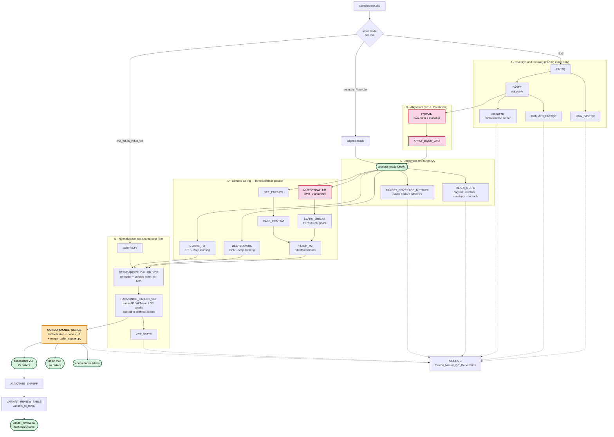

# Tumor-only WES somatic variant pipeline

A Nextflow DSL2 pipeline for **tumor-only whole-exome somatic variant calling** on GRCh38 (Broad
hg38/assembly38 bundle), built for GPU-accelerated execution on a Slurm cluster.

Tumor-only calling has no matched normal to subtract germline variation, so the pipeline's core
strategy is **three independent callers plus consensus**: run Mutect2, DeepSomatic and ClairS-TO on
the same BQSR'd CRAM, normalize every VCF to identical allele representation, apply one shared
AF/ALT-read/depth post-filter to all three, and keep the variants that at least two callers agree on.

| | |
| --- | --- |
| **Workflow manager** | Nextflow DSL2 |
| **Executor** | Slurm (`-profile slurm`), Apptainer/Singularity containers |
| **Reference** | GRCh38 — Broad `Homo_sapiens_assembly38.fasta` |
| **Callers** | Parabricks Mutect2, DeepSomatic, ClairS-TO |
| **Consensus rule** | `bcftools isec -c none -n+2` (exact CHROM/POS/REF/ALT identity) |
| **Annotation** | snpEff, optional `bcftools annotate` passthrough |

---

## Workflow overview



Pink = GPU steps. Orange = the consensus step. Green = key deliverables. Dotted lines feed MultiQC.

**Reading the diagram:** a sample enters at one of three points depending on what you already have.
FASTQ rows traverse the whole graph. CRAM/BAM rows skip stages A and B and enter at
`analysis-ready CRAM`. VCF rows skip everything up to stage E and enter directly at normalization —
useful for re-running just the consensus and annotation logic with different thresholds.

For a process-by-process reference — inputs, outputs, tools, and resource labels — see
**[docs/WORKFLOW.md](docs/WORKFLOW.md)**.

---

## Requirements

On the cluster you need:

- Nextflow (`module load nextflow`)
- Apptainer (`module load apptainer`)
- Environment modules: `fastqc`, `fastp`, `multiqc`, `samtools`, `bedtools`, `bcftools`, `snpEff`
- micromamba environments: `kraken2`, `mosdepth`
- Python 3 for the three helper scripts (no third-party packages required)
- Slurm partitions for GPU and CPU work

Containers (overridable by environment variable):

| Container | Default path | Env var |
| --- | --- | --- |
| Parabricks | `/common/sif/clara-parabricks/4.5.1.sif` | `PB_SIF` |
| GATK | `/common/sif/gatk/4.6.1.0.sif` | `GATK_SIF` |
| ClairS-TO | `/common/sif/Clairs-TO/Clairs-TO.v0.4.2.sif` | `CLAIRS_TO_SIF` |
| DeepSomatic | `/common/sif/deepsomatic/deepsommatic_1.10.sif` | `DEEPSOMATIC_SIF` |

---

## Quick start

```bash
module load apptainer nextflow
export NXF_SINGULARITY_CMD=apptainer

nextflow run main.nf \
  -profile slurm \
  -resume \
  --samplesheet sample.csv \
  --outdir /path/to/results \
  --num_gpus 2
```

Or submit the wrapper as a Slurm job:

```bash
sbatch mutact.sh
```

`mutact.sh` runs from FASTQ; `mutact_cram.sh` runs from existing CRAM. Both are thin `sbatch`
wrappers — edit the `--samplesheet` and `--outdir` lines before submitting. The Nextflow head job
itself is small (4 CPU / 16 GB); the real work is dispatched to Slurm by the `slurm` profile.

Always pass `-resume`. Nextflow caches completed tasks, so a re-run after a failure picks up where
it stopped instead of recomputing GPU alignment.

---

## Inputs

The samplesheet is a CSV with a header row. **Each row must use exactly one input mode** — the
pipeline rejects rows that mix modes, have a duplicate sample name, or point at a path that does not
exist. Sample names must match `[A-Za-z0-9][A-Za-z0-9_.-]*`.

**Mode 1 — FASTQ** (full pipeline, includes alignment):

```csv
sample,r1,r2
S1-DA-01,/path/S1-DA-01_R1.fq.gz,/path/S1-DA-01_R2.fq.gz
```

**Mode 2 — BAM:**

```csv
sample,bam,bai
S1-DA-01,/path/S1-DA-01.bam,/path/S1-DA-01.bam.bai
```

**Mode 3 — CRAM:**

```csv
sample,cram,crai
S1-DA-01,/path/S1-DA-01.bqsr.cram,/path/S1-DA-01.bqsr.cram.crai
```

**Mode 4 — existing caller VCFs** (re-run consensus + annotation only):

```csv
sample,m2_vcf,ds_vcf,ct_vcf
S1-DA-01,/path/S1.mutect2.filtered.vcf.gz,/path/S1.deepsomatic.vcf.gz,/path/S1.clairsto.vcf.gz
```

One single-sample VCF per caller. For Mutect2 use the VCF **after** `FilterMutectCalls`, not the raw
unfiltered output. Compressed VCFs must have a `.tbi` or `.csi` index alongside them.

Different rows in the same samplesheet may use different modes.

### BAM/CRAM assumptions

Starting from `bam,bai` or `cram,crai` **skips alignment, duplicate marking and BQSR entirely**. The
file must already be:

- aligned to `params.ref`
- coordinate-sorted and indexed
- duplicate-marked
- preferably BQSR-applied, from the same reference/resource bundle
- carrying a tumor sample name consistent with the `sample` column

If any of those is not true, start from FASTQ instead. Mismatched references are the most common
cause of silent garbage output here.

---

## Parameters

### Core

| Param | Default | Meaning |
| --- | --- | --- |
| `--samplesheet` | *(required)* | Input CSV. Also settable via `SAMPLESHEET`. |
| `--outdir` | `results` | Output root. |
| `--num_gpus` | `2` | GPUs per Parabricks task. Drives CPU/memory sizing in the slurm profile. |
| `--skip_trimming` | `false` | Skip fastp and trimmed FastQC; align raw reads. |
| `--exome_bed` | *(cluster default)* | Target BED. Restricts calling and coverage QC. |
| `--exome_bait_bed` | `= exome_bed` | Vendor bait BED. Falls back to the target BED, which makes enrichment metrics approximate. |
| `--python_bin` | `python3` | Python used by the three helper scripts. |
| `--rg_lb` / `--rg_pl` | `lib1` / `ILLUMINA` | Read-group library and platform. |

### Caller tuning

| Param | Default | Meaning |
| --- | --- | --- |
| `--pipeline_preset` | `default` | Preset bundle for Mutect2 sensitivity, ClairS-TO AF thresholds and post-filter cutoffs. |
| `--mutect_low_lod` | preset-driven | Low-LOD exploratory Mutect2 (`--initial-tumor-lod 1.0 --tumor-lod-to-emit 1.0`). |
| `--mutect_extra_args` | empty | Appended verbatim to `pbrun mutectcaller`. |
| `--deepsomatic_model_type` | `WES_TUMOR_ONLY` | Requested DeepSomatic model. |
| `--deepsomatic_fallback_model_type` | `WGS_TUMOR_ONLY` | Used automatically if the container lacks WES mode. |
| `--deepsomatic_extra_args` | empty | Appended to `run_deepsomatic`. |
| `--clairs_to_platform` | `ilmn_ssrs` | ClairS-TO platform model. |
| `--clairs_to_snv_min_af` | preset-driven | ClairS-TO SNV AF threshold. |
| `--clairs_to_indel_min_af` | preset-driven | ClairS-TO indel AF threshold. |
| `--clairs_to_min_coverage` | preset-driven | ClairS-TO minimum coverage. |
| `--clairs_to_extra_args` | empty | Appended to `run_clairs_to`. |

### Shared post-filter and merge

These cutoffs are applied identically to **all three callers** after normalization, so no caller gets
an unfair advantage from its native filtering:

| Param | Default | Meaning |
| --- | --- | --- |
| `--postfilter_snv_min_af` | preset-driven | Minimum SNV VAF. |
| `--postfilter_indel_min_af` | preset-driven | Minimum indel VAF. |
| `--postfilter_snv_min_alt_reads` | preset-driven | Minimum SNV supporting reads. |
| `--postfilter_indel_min_alt_reads` | preset-driven | Minimum indel supporting reads. |
| `--postfilter_snv_min_dp` | preset-driven | Minimum SNV depth. |
| `--postfilter_indel_min_dp` | preset-driven | Minimum indel depth. |
| `--merge_min_callers` | `2` | Caller support required for the concordant VCF (1–3). |

### Presets

| Preset | Mutect2 | ClairS-TO | Harmonized SNV | Harmonized indel |
| --- | --- | --- | --- | --- |
| `default` / `moderate` | standard LOD | SNV AF ≥ 0.02, indel AF ≥ 0.05, cov ≥ 10 | AF ≥ 0.02, ALT ≥ 5, DP ≥ 30 | AF ≥ 0.05, ALT ≥ 5, DP ≥ 30 |
| `low_af` | low-LOD enabled | SNV AF ≥ 0.01, indel AF ≥ 0.02, cov ≥ 10 | AF ≥ 0.01, ALT ≥ 10, DP ≥ 50 | AF ≥ 0.02, ALT ≥ 10, DP ≥ 50 |

`low_af` trades specificity for sensitivity at low tumor fraction: it loosens the AF floor but
compensates by demanding more supporting reads and deeper coverage. Any explicit CLI param overrides
the preset value.

For exploratory review keep `--merge_min_callers 2` and inspect the union VCF plus the support TSV,
rather than lowering the production concordance threshold.

### Reference and resource paths

All default to the cluster's Broad hg38 bundle and are overridable by CLI param or environment
variable:

| Resource | Env var | Default |
| --- | --- | --- |
| Reference FASTA | `REF_FA` | `/common/db/human_ref/hg38/v0/Homo_sapiens_assembly38.fasta` |
| Mills indels | `MILLS_VCF` | `.../Mills_and_1000G_gold_standard.indels.hg38.vcf.gz` |
| dbSNP | `DBSNP_VCF` | `.../Homo_sapiens_assembly38.dbsnp138.vcf.gz` |
| gnomAD AF | `MUTECT_GERMLINE_RESOURCE_VCF` | `.../af-only-gnomad.hg38.vcf.gz` |
| Contamination sites | `CONTAMINATION_SITES_VCF` | `.../small_exac_common_3.hg38.vcf.gz` |
| Mutect PON | `MUTECT_PON_VCF` | `.../1000g_pon.hg38.vcf.gz` |
| Target BED | `EXOME_BED` | `.../S33266436_Padded.chr.clean.bed` |
| Kraken2 DB | `KRAKEN_DB` | `/common/db/microbiome_ref/kraken2_DB/PlusPF` |

ClairS-TO additionally uses four population/PON VCFs (`CLAIRS_TO_GNOMAD`, `CLAIRS_TO_DBSNP`,
`CLAIRS_TO_PON`, `CLAIRS_TO_COLORSDB`). **All four must exist** or the pipeline logs a warning and
falls back to ClairS-TO's built-in defaults — it will not run with a partial set.

Keep one consistent build across FASTA, known sites, PON, germline AF, target BED and annotation
databases. Mutect resources in particular must match Broad hg38/assembly38, not GRCh38.p14.

### Apptainer binds

`APPTAINER_BIND_PATHS` (default `/common:/common,/project:/project,/scratch:/scratch`) is expanded
into `--bind` flags. Set `APPTAINER_BIND_ARGS` directly if your site needs flags other than simple
bind pairs.

---

## Outputs

Everything lands under `--outdir`:

```
<outdir>/
├── cram/                     # markdup CRAM + reference copy
├── cram_bqsr/                # BQSR-applied CRAM (calling input)
├── fastq_trim/               # fastp-trimmed FASTQ
├── qc/
│   ├── 01_raw_qc/            # raw FastQC
│   ├── 02_trimmed_qc/        # fastp + trimmed FastQC
│   ├── 03_kraken_reports/    # Kraken2 contamination screen
│   └── 04_final_report/      # Exome_Master_QC_Report.html  ← start here
├── qc_stats/                 # flagstat, idxstats, mosdepth, bedtools coverage
├── qc_target_coverage/       # Picard HsMetrics, interval lists
├── vcf_raw/                  # per-caller native output
├── vcf_filtered/             # Mutect2 FilterMutectCalls + contamination tables
├── vcf_standardized/         # normalized, sample-renamed
├── vcf_harmonized/           # after shared AF/ALT/DP filter
├── vcf_concordant/           # concordant + union VCFs
├── vcf_annotated/            # snpEff-annotated
├── vcf_stats/                # bcftools stats
├── tables/                   # TSV review + concordance tables
├── logs/                     # DeepSomatic and ClairS-TO logs
└── pipeline_info/            # execution report, timeline, trace
```

### Key files

| File | What it is |
| --- | --- |
| `tables/{sample}.variant_review.tsv` | **Primary deliverable** — annotated concordant variants, one row per variant, ranked by snpEff impact. |
| `vcf_concordant/{sample}.concordant.vcf.gz` | Variants supported by ≥ `merge_min_callers`. |
| `vcf_concordant/{sample}.all_callers.vcf.gz` | Union of all caller calls — use for sensitivity review. |
| `vcf_annotated/{sample}.snpeff.vcf.gz` | snpEff-annotated concordant VCF. |
| `qc/04_final_report/Exome_Master_QC_Report.html` | MultiQC aggregate across every QC step. |
| `tables/{sample}.caller_support.tsv` | Support count plus per-caller AF/DP/AD evidence. |
| `tables/{sample}.all_callers_support.tsv` | Same evidence table for the full union. |
| `tables/{sample}.caller_characteristics.tsv` | Per-caller variant-type counts, AF/DP/QUAL summaries, singleton counts. |
| `tables/{sample}.concordance_summary.tsv` | Counts per support size and per exact caller combination. |
| `tables/{sample}.pairwise_concordance.tsv` | Pairwise shared/specific counts, union, Jaccard index. |
| `tables/{sample}.{caller}.harmonized_filter.tsv` | How many records each post-filter criterion removed. |

### Merged VCF INFO fields

The concordant and union VCFs carry `SUPPORT` (caller count), `CALLERS` (which ones),
`SELECTED_CALLER` (whose record was kept as representative), and per-caller evidence fields prefixed
`M2_`, `DS_`, `CT_` — e.g. `M2_AF`, `DS_DP`, `CT_AD`, plus `*_FILTER` and `*_QUAL`.

Concordance uses **exact allele identity** — same CHROM, POS, REF and ALT — evaluated *after*
normalization and harmonized post-filtering, gated by `bcftools isec -c none -n+2`. This is why
normalization is not optional: without `bcftools norm -m -both` against a common reference, the same
biological variant written three different ways by three callers would never intersect.

---

## Optional extra annotation

Inject any `bcftools annotate` arguments after snpEff:

```bash
--annotation_bcftools_args '-a /path/clinvar.vcf.gz -c INFO/CLNSIG,INFO/CLNDN,INFO/CLNREVSTAT'
```

`variants_to_tsv.py` already looks for `CLNSIG`, `CLNDN`, `CLNREVSTAT`, `CLNVC`, `CLNHGVS`, `COSMIC`,
`HOTSPOT`, `CIVIC_ID`, `ONCOKB` and gnomAD AF fields, so anything you annotate under those names
appears in the review table automatically. Keep annotation VCFs on the same build and contig naming
as `params.ref`.

---

## Helper scripts

`scripts/` holds three Python helpers called by the workflow and three standalone operator scripts:

| Script | Purpose |
| --- | --- |
| `harmonize_filter_vcf.py` | Applies the shared AF/ALT-read/DP filter. Pulls metrics from FORMAT then INFO, deriving AF and ALT count from `AD` when a caller does not report them directly. Writes a per-criterion rejection summary. |
| `merge_caller_support.py` | Consumes `bcftools isec` output, builds the concordant and union VCFs with caller-support INFO fields, and emits all five concordance tables. |
| `variants_to_tsv.py` | Flattens the annotated VCF into the review TSV, ranking snpEff annotations by impact (HIGH > MODERATE > LOW > MODIFIER). |
| `prepare_mutect_pon.sh` | Standalone. Subsets a PON to the reference contigs, reheaders it against the reference `.fai`, and reruns `pbrun prepon`. Use when Mutect2 rejects a PON for contig mismatch. |
| `run_clairs_to_manual.sh` | Standalone `sbatch` script to run ClairS-TO outside Nextflow for one sample, with `--fast` and `--debug` modes. Useful for debugging a stuck ClairS-TO task. |
| `check_clairs_to_status.sh` | Standalone. Inspects a Nextflow work directory for a running or failed ClairS-TO task and tails its logs. |

---

## Resource profile

The `slurm` profile assigns four resource labels. Tune these in `nextflow.config` for your cluster:

| Label | CPUs | Memory | Time | Used by |
| --- | --- | --- | --- | --- |
| `gpu` | 24 (2 GPU) / 16 (1 GPU) | 370 GB / 200 GB | 24 h | FQ2BAM, APPLY_BQSR_GPU, MUTECTCALLER |
| `cpu_max` | 32 | 512 GB | 24 h | DEEPSOMATIC, CLAIRS_TO |
| `cpu_med` | 12 | 128 GB | 12 h | FASTP, KRAKEN2, ALIGN_STATS, ANNOTATE_SNPEFF |
| `cpu_low` | 4 | 32 GB | 8 h | FastQC, MultiQC, GATK filtering steps, VCF processing |

GPU tasks run with `maxForks = 1` — one GPU job at a time, regardless of how many samples are queued.
Set `SLURM_GPU_PARTITION`, `SLURM_CPU_PARTITION` and `SLURM_ACCOUNT` for your site.

Tasks retry twice on exit codes `104, 137, 139, 140, 143, 247, 255` (OOM and node failures); any
other non-zero exit terminates the run.

---

## Troubleshooting

**DeepSomatic falls back to WGS mode.** Expected on containers without `WES_TUMOR_ONLY`. The
pipeline detects this from `run_deepsomatic --help`, logs it to
`logs/deepsomatic/{sample}.deepsomatic.log`, and compensates with `--regions <exome_bed>`. Calls stay
target-restricted.

**ClairS-TO produces no variants.** The process warns rather than failing when both `snv.vcf.gz` and
`indel.vcf.gz` are empty. Check `logs/clairs_to/{sample}.clairs_to.log`. It only hard-fails if
neither file is produced at all. `scripts/check_clairs_to_status.sh <workdir>` tails a live task.

**ClairS-TO ignores the custom PON.** All four PON resources must exist. If any is missing you get a
`log.warn` at startup and ClairS-TO runs with its built-in defaults.

**Mutect2 rejects the PON.** Usually a contig mismatch between PON and reference. Run
`scripts/prepare_mutect_pon.sh --in-pon-file <pon> --ref-fai <ref>.fai`.

**Concordant VCF is empty but individual callers found variants.** Check
`tables/{sample}.pairwise_concordance.tsv` — if Jaccard indices are near zero, the callers are not
agreeing on allele representation. Confirm all three ran against the same `params.ref`.

**Too few variants survive.** Read `tables/{sample}.{caller}.harmonized_filter.tsv` — it breaks down
rejections into `failed_af`, `failed_alt_reads`, `failed_dp` and `missing_metrics`. A high
`missing_metrics` count means a caller is not emitting AF/DP/AD in an expected field.

**`CollectHsMetrics` enrichment numbers look off.** Likely `exome_bait_bed` defaulting to the target
BED. Supply the real vendor bait BED for accurate bait/enrichment metrics.

---

## License

See [LICENSE](LICENSE).
