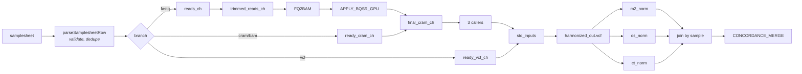
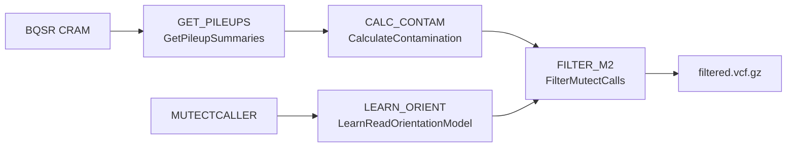

# Workflow reference

Process-by-process detail for the tumor-only WES pipeline. For setup and parameters see the
[main README](../Readme.md).

---

## Contents

- [Design rationale](#design-rationale)
- [Channel topology](#channel-topology)
- [Stage A — read QC and trimming](#stage-a--read-qc-and-trimming)
- [Stage B — alignment](#stage-b--alignment)
- [Stage C — alignment and target QC](#stage-c--alignment-and-target-qc)
- [Stage D — somatic calling](#stage-d--somatic-calling)
- [Stage E — normalization and harmonization](#stage-e--normalization-and-harmonization)
- [Stage F — concordance merge](#stage-f--concordance-merge)
- [Stage G — annotation and review](#stage-g--annotation-and-review)
- [Stage H — MultiQC](#stage-h--multiqc)
- [Process index](#process-index)

---

## Design rationale

### Why three callers

Tumor-only calling cannot subtract a matched normal, so every germline variant is a potential false
positive. The usual mitigations — a panel of normals, a population AF resource, a germline database
— all reduce but do not eliminate the problem, and each caller's approach fails differently:

- **Mutect2** is a haplotype-based statistical caller. Strong on well-covered SNVs with a principled
  LOD model, but its tumor-only mode leans heavily on the PON and germline AF resource.
- **DeepSomatic** is a deep-learning pileup classifier. Different error profile from Mutect2 —
  notably better on some indel classes — but is a black box you cannot tune analytically.
- **ClairS-TO** is also deep learning, purpose-built for tumor-only, with its own multi-database
  germline filtering.

Their false positives are largely uncorrelated; their true positives are largely shared. Requiring
two-of-three support removes most caller-specific artifacts while keeping real somatic variants.

### Why normalize before comparing

Three callers will write the same biological variant three different ways — different left-alignment,
multi-allelic records versus split records, different representations of the same indel. Intersecting
raw VCFs would report near-zero concordance for entirely artifactual reasons.

`STANDARDIZE_CALLER_VCF` runs `bcftools norm -f <ref> -m -both`: left-align and normalize indels
against the reference, and split multi-allelic records into biallelic ones. Only then is exact
CHROM/POS/REF/ALT matching meaningful.

### Why a shared post-filter

Each caller applies its own internal quality filters at different stringencies. If the consensus were
computed on caller-native PASS calls, the strictest caller would silently set the pipeline's
sensitivity floor, and concordance rates would measure filter agreement rather than variant
agreement.

`HARMONIZE_CALLER_VCF` applies one AF/ALT-read/DP cutoff to all three callers, so the comparison is
apples-to-apples. Mutect2 still runs `FilterMutectCalls` — the orientation-bias and contamination
models are genuinely valuable — but the final gate is the shared filter.

---

## Channel topology



Two convergence points matter:

- **`final_cram_ch`** — `bqsr_cram_from_fq.mix(ready_cram_ch)`. FASTQ-derived and pre-aligned samples
  become indistinguishable here; everything downstream treats them identically.
- **`std_inputs`** — all three pipeline callers plus all three user-supplied VCF channels mixed into
  one stream tagged `(sample, caller_id, vcf)`. This is why VCF-mode input rejoins cleanly: it enters
  the same normalization path as freshly called variants.

After harmonization the stream is split back out by `caller_id` and re-joined by sample, so
`CONCORDANCE_MERGE` receives exactly one tuple per sample carrying all three caller VCFs.

---

## Stage A — read QC and trimming

*FASTQ-mode rows only.*

### `RAW_FASTQC` · `cpu_low`
Baseline FastQC on untrimmed reads. → `qc/01_raw_qc/`

### `FASTP` · `cpu_med`
Adapter and quality trimming with `--trim_poly_g --low_complexity_filter
--overrepresentation_analysis`. Poly-G trimming matters on two-colour Illumina chemistry (NovaSeq,
NextSeq), where a dark cycle reads as G and produces spurious G-homopolymer tails.

Emits trimmed FASTQ plus HTML and JSON reports. Skipped entirely when `--skip_trimming true`, in
which case `trimmed_reads_ch` is just the raw reads and the fastp/trimmed-FastQC channels are empty.

→ `fastq_trim/`, `qc/02_trimmed_qc/`

### `TRIMMED_FASTQC` · `cpu_low`
FastQC on trimmed reads, for before/after comparison in MultiQC. → `qc/02_trimmed_qc/`

### `KRAKEN2` · `cpu_med`
Taxonomic classification against the PlusPF database — a contamination screen that catches
bacterial, fungal or cross-species contamination that alignment rate alone would miss. Runs from a
micromamba environment; the script deliberately drops `set -u` around activation because conda
deactivate hooks reference unset variables.

→ `qc/03_kraken_reports/`

---

## Stage B — alignment

*FASTQ-mode rows only. GPU, Parabricks container.*

### `FQ2BAM` · `gpu`
`pbrun fq2bam` — GPU bwa-mem alignment, coordinate sort, duplicate marking, and BQSR table
generation, in one pass. Writes CRAM directly via `--gpuwrite --gpusort`.

Known sites for the recalibration table are Mills indels and dbSNP. Read groups are constructed from
the sample name plus `--rg_lb` / `--rg_pl`.

`-K 10000000` is appended to the bwa options: it fixes the input chunk size so alignment output is
deterministic regardless of thread count.

Outputs `(sample, markdup.cram, crai, recal.txt)`. → `cram/`

### `APPLY_BQSR_GPU` · `gpu`
`pbrun applybqsr` applies the recalibration table. Output is the analysis-ready CRAM every caller
consumes. → `cram_bqsr/`

### `COPY_REF_TO_CRAM_DIR` · `cpu_low`
Hard-links (falling back to reflink copy) the reference FASTA, `.fai` and `.dict` next to the
published CRAMs, so the CRAM directory is self-contained — CRAM cannot be decoded without its
reference. Gated on `FQ2BAM` completion.

---

## Stage C — alignment and target QC

*All samples with a CRAM, whichever way they got one.*

### `ALIGN_STATS` · `cpu_med`
Four coverage and alignment views:

| Tool | Output | Purpose |
| --- | --- | --- |
| `samtools flagstat` | `.flagstat.txt` | Mapping rate, duplicates, proper pairs |
| `samtools idxstats` | `.idxstats.txt` | Per-contig read counts |
| `samtools depth` | `.samtools_depth.txt` | Per-base depth within targets |
| `mosdepth` | `.mosdepth.*` | Fast coverage distribution summaries |
| `bedtools coverage` | `.bedtools_coverage.txt` | Per-target coverage |

`mosdepth` runs with `--no-per-base` — MultiQC only consumes the summary and distribution files, and
per-base output is expensive. `bedtools coverage` has no thread flag, so the CRAM is pre-filtered and
decoded by a threaded `samtools view -M -L`, then streamed into bedtools' memory-efficient sorted
sweep.

→ `qc_stats/`

### `TARGET_COVERAGE_METRICS` · `cpu_low`
GATK `BedToIntervalList` converts bait and target BEDs to interval lists, then `CollectHsMetrics`
produces hybrid-selection metrics — fold enrichment, percent off-bait, percent target bases at
depth thresholds.

Two cost switches, both off by default:

- `--target_cov_emit_aux` — adds `samtools depth` and `samtools bedcov` summaries. Redundant with
  `ALIGN_STATS` for routine QC.
- `--target_cov_per_target` — adds Picard `--PER_TARGET_COVERAGE`. Substantially slower on large
  target sets.

→ `qc_target_coverage/`

---

## Stage D — somatic calling

Three callers run **in parallel** on the same CRAM.

### `MUTECTCALLER` · `gpu`
`pbrun mutectcaller` in tumor-only mode with the gnomAD AF resource, optional PON, and target
restriction. Emits the unfiltered VCF, the f1r2 tarball for orientation-bias modelling, and the
stats file `FilterMutectCalls` needs.

With `mutect_low_lod` enabled, adds `--initial-tumor-lod 1.0 --tumor-lod-to-emit 1.0` — emits
lower-confidence calls for exploratory review.

→ `vcf_raw/`

### Mutect2 filtering chain



- **`GET_PILEUPS`** · `cpu_low` — allele fractions at common biallelic SNP sites
  (`small_exac_common_3`), restricted to targets.
- **`CALC_CONTAM`** · `cpu_low` — estimates cross-sample contamination from those pileups. Contaminant
  reads produce low-AF alt alleles that mimic subclonal somatic variants, so this estimate directly
  informs the filter.
- **`LEARN_ORIENT`** · `cpu_low` — builds read-orientation artifact priors from the f1r2 counts.
  Catches FFPE deamination (C>T) and OxoG (G>T) artifacts, which appear on one strand only.
- **`FILTER_M2`** · `cpu_low` — `FilterMutectCalls` combining the stats, contamination table and
  orientation priors.

→ `vcf_filtered/`

### `DEEPSOMATIC` · `cpu_max`
Runs `run_deepsomatic` in the DeepSomatic container.

The process **probes the container at runtime**: it greps `run_deepsomatic --help` for the requested
model type. If `WES_TUMOR_ONLY` is absent it falls back to `WGS_TUMOR_ONLY` with `--regions
<exome_bed>` for target restriction, and records the decision in the log. If neither the requested
model nor the fallback is present, it fails with a clear message rather than silently using the wrong
model.

PON handling: a custom `--pon_filtering` when `params.pon_vcf` is set, otherwise
`--use_default_pon_filtering=true`.

→ `vcf_raw/`, `logs/deepsomatic/`

### `CLAIRS_TO` · `cpu_max`
Runs `run_clairs_to` via Apptainer with the platform model, AF and coverage thresholds, and optional
four-database panel of normals (gnomAD, dbSNP, 1000G PON, CoLoRSdb). Allele matching is required for
gnomAD and dbSNP, not for the two PON databases.

ClairS-TO writes `snv.vcf.gz` and `indel.vcf.gz` separately, so the process concatenates and sorts
them into one VCF matching the other callers' shape. It counts records first and warns if both are
empty; it hard-fails only if neither file exists.

→ `vcf_raw/`, `logs/clairs_to/`

---

## Stage E — normalization and harmonization

### `STANDARDIZE_CALLER_VCF` · `cpu_low`
1. Verifies the VCF is single-sample — errors out on multi-sample input, which would mean a
   tumor/normal VCF reached a tumor-only pipeline.
2. `bcftools reheader` renames the sample to the samplesheet name, so all three callers agree.
3. `bcftools norm -f <ref> -m -both` left-aligns, normalizes indels, and splits multi-allelics.

→ `vcf_standardized/`

### `HARMONIZE_CALLER_VCF` · `cpu_low`
Runs `scripts/harmonize_filter_vcf.py`, applying the shared AF / ALT-read / DP thresholds with
separate cutoffs for SNVs and indels.

Metric extraction is deliberately tolerant, because the three callers do not agree on field names:

| Metric | Looked up in FORMAT | then INFO | then derived |
| --- | --- | --- | --- |
| AF | `AF`, `VAF`, `T_AF`, `TUMOR_AF` | `AF`, `VAF`, `TLOD_AF`, `ALLELE_FRACTION` | from `AD` |
| DP | `DP`, `T_DP` | `DP`, `TDP` | from `AD` sum |
| ALT reads | from `AD`/`T_AD` | — | `AO`, `NV`, `ALT_COUNT` |

A record with no usable AF, DP **and** ALT count is dropped and counted under `missing_metrics`. The
per-caller summary TSV reports counts for `missing_metrics`, `failed_af`, `failed_alt_reads` and
`failed_dp`, so you can see exactly which criterion is doing the filtering.

→ `vcf_harmonized/`, `tables/{sample}.{caller}.harmonized_filter.tsv`

### `VCF_STATS` · `cpu_low`
`bcftools stats` per harmonized VCF, feeding MultiQC. → `vcf_stats/`

---

## Stage F — concordance merge

### `CONCORDANCE_MERGE` · `cpu_low`

```bash
bcftools isec -c none -n+<min_callers> -p isec_out <m2> <ds> <ct>
```

`-c none` demands exact allele identity — same CHROM, POS, REF and ALT. No fuzzy position matching,
no REF/ALT collapsing. `-n+2` keeps sites present in at least two of the three inputs.

`scripts/merge_caller_support.py` then walks the isec output and both builds the merged VCFs and
computes the concordance statistics:

**VCFs**

- `{sample}.concordant.vcf.gz` — sites meeting the support threshold
- `{sample}.all_callers.vcf.gz` — union of everything

Both carry `SUPPORT`, `CALLERS`, `SELECTED_CALLER`, and per-caller evidence under `M2_`, `DS_`, `CT_`
prefixes (`_FILTER`, `_QUAL`, `_AF`, `_DP`, `_AD`).

**Tables**

| Table | Contents |
| --- | --- |
| `caller_support.tsv` | One row per concordant variant with support count and per-caller evidence |
| `all_callers_support.tsv` | Same for the union set |
| `caller_characteristics.tsv` | Per caller: variant-type counts, AF/DP/QUAL summaries, singleton count, 2+-support count |
| `concordance_summary.tsv` | Counts by support size and by exact combination (`mutect2+deepsomatic`, all three, …) |
| `pairwise_concordance.tsv` | For each caller pair: shared, caller-specific, union, Jaccard index, shared percentages |

`pairwise_concordance.tsv` is the diagnostic to reach for first when the concordant set looks wrong.
Uniformly low Jaccard indices point at a normalization or reference problem, not a biology problem.

→ `vcf_concordant/`, `tables/`

---

## Stage G — annotation and review

### `ANNOTATE_SNPEFF` · `cpu_med`
snpEff against the configured database (default `hg38`), output sorted and bgzipped. Emits the
annotated VCF, the snpEff summary HTML, and the per-gene table.

If `--annotation_bcftools_args` is set, `bcftools annotate` runs afterwards with those arguments
verbatim — the hook for ClinVar, COSMIC or any other resource.

→ `vcf_annotated/`

### `VARIANT_REVIEW_TABLE` · `cpu_low`
`scripts/variants_to_tsv.py` flattens the annotated VCF into one row per variant. Where snpEff emits
multiple transcript annotations, it ranks by impact — HIGH > MODERATE > LOW > MODIFIER — and reports
the most severe. Also surfaces clinical fields when present: `CLNSIG`, `CLNDN`, `CLNREVSTAT`,
`CLNVC`, `CLNHGVS`, `COSMIC`, `HOTSPOT`, `CIVIC_ID`, `ONCOKB`, and gnomAD AF variants.

→ `tables/{sample}.variant_review.tsv` — **the primary deliverable.**

---

## Stage H — MultiQC

### `MULTIQC` · `cpu_low`
Aggregates every QC output — raw and trimmed FastQC, fastp, Kraken2, flagstat, idxstats, mosdepth,
bedtools coverage, Picard HsMetrics, and bcftools stats from both the harmonized caller VCFs and the
concordant VCF — into a single report.

→ `qc/04_final_report/Exome_Master_QC_Report.html`

---

## Process index

| Process | Label | Container/env | Stage |
| --- | --- | --- | --- |
| `RAW_FASTQC` | `cpu_low` | module `fastqc` | A |
| `FASTP` | `cpu_med` | module `fastp` | A |
| `TRIMMED_FASTQC` | `cpu_low` | module `fastqc` | A |
| `KRAKEN2` | `cpu_med` | micromamba `kraken2` | A |
| `FQ2BAM` | `gpu` | Parabricks | B |
| `APPLY_BQSR_GPU` | `gpu` | Parabricks | B |
| `COPY_REF_TO_CRAM_DIR` | `cpu_low` | GATK | B |
| `ALIGN_STATS` | `cpu_med` | modules + micromamba `mosdepth` | C |
| `TARGET_COVERAGE_METRICS` | `cpu_low` | GATK via Apptainer | C |
| `MUTECTCALLER` | `gpu` | Parabricks | D |
| `GET_PILEUPS` | `cpu_low` | GATK | D |
| `CALC_CONTAM` | `cpu_low` | GATK | D |
| `LEARN_ORIENT` | `cpu_low` | GATK | D |
| `FILTER_M2` | `cpu_low` | GATK | D |
| `DEEPSOMATIC` | `cpu_max` | DeepSomatic | D |
| `CLAIRS_TO` | `cpu_max` | ClairS-TO via Apptainer | D |
| `STANDARDIZE_CALLER_VCF` | `cpu_low` | module `bcftools` | E |
| `HARMONIZE_CALLER_VCF` | `cpu_low` | module `bcftools` + python3 | E |
| `VCF_STATS` | `cpu_low` | module `bcftools` | E |
| `CONCORDANCE_MERGE` | `cpu_low` | module `bcftools` + python3 | F |
| `ANNOTATE_SNPEFF` | `cpu_med` | module `snpEff` | G |
| `VARIANT_REVIEW_TABLE` | `cpu_low` | python3 | G |
| `MULTIQC` | `cpu_low` | module `multiqc` | H |
